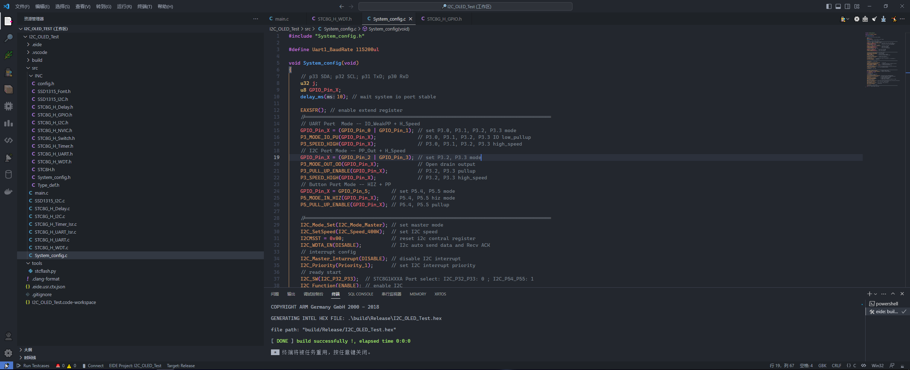
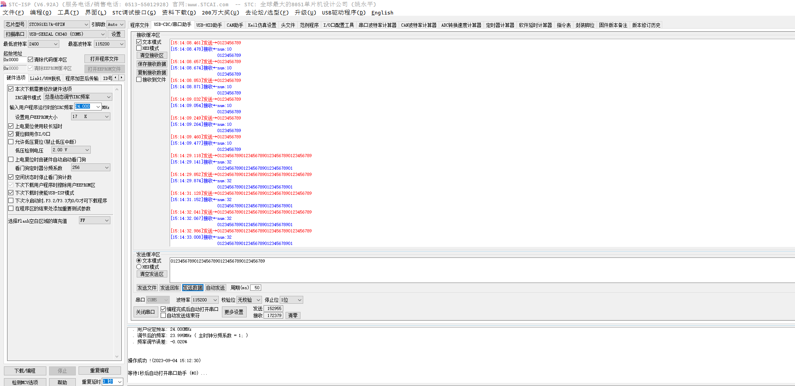
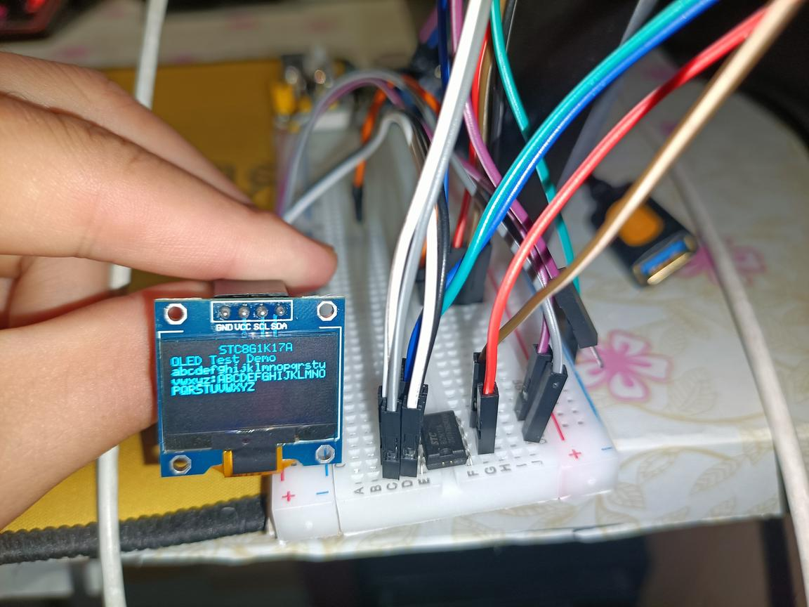

# STC8G1K17A 测试项目

本仓库用于存放本人在开发**STC8G1k17A**过程中所用到的测试工程，包含uart串口收发、i2c配置与使用等小项目。

对您有用的话，还希望动动小手点个Star呀😊！

（继续开发中...）

# 项目开发环境

  IDE: VS Code
  
  插件：EIDE 插件
  
  编译器：keil C51 (V 9.60.7.0)
  
  烧录方式：CH340 + STC-ISP

# 每个独立xxx_Test项目目录结构
```
├───.eide
│   └───log
├───.vscode
├───build
│   └───Release
│       └───src    // hex
├───src             // all .c/.h files
│   └───INC
└───tools
```

# Demo 展示








